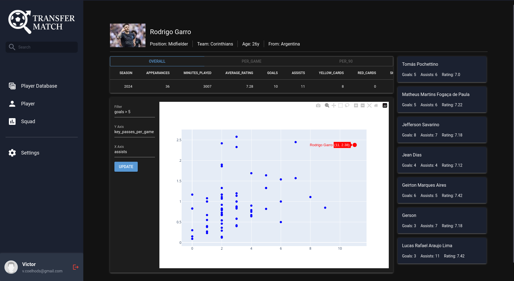

# TransferMatch



A web-based client and server for reading, analyzing and comparing stats for different players across Brasileirão Série A and B. The actual data is taken from FootyStats.org.

### Installation

To install and run the project, an existing Python installation (version 3.12+) with pip is required. After installing Python 3.12+, run the following commands on a terminal application, such as Powershell or Bash:

Cloning the repository: ```git clone https://github.com/victorcoelh/football-scouting.git```

Installing the required dependencies with UV:
```
pip install uv
uv sync
uv pip install -e .
```

### Running locally

Starting the server:
```fastapi dev src/server/main.py```

Starting the web client:
```uv run src/web_client/main.py```

After that, the web UI should be available at port 8080 on localhost (http://127.0.0.1:8080). The backend server is available at port 8000 for debugging purposes.
